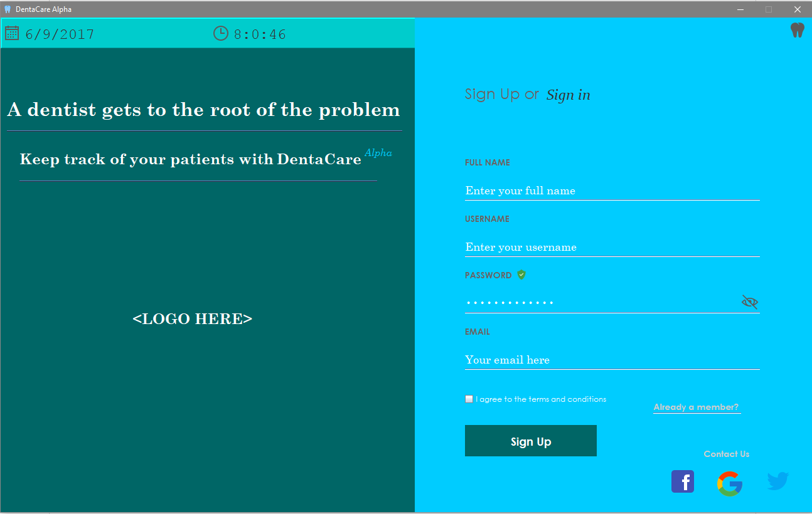

 <h1> DentaCare <h1>\
 
   
<h1> Introduction
</h1> 
DentaCare is a simple and reliable Software Application built (and is still being built) for dental management and operation.  
Key features of DentaCare:
<ul style="list-style-type:circle">
<li> Keep track of patients' record </li>
<ul style="list-style-type:circle"> <li> No longer will dentists or dental secretaries have piles of papers of their patients' record just to keep track of their previous appointments, personal information and dental proceduries. DentaCare is a 21st century-looking, user-friendly software that does the data storage and ensures a secured and easily accessible database that is non-cloud based. </li>
<li> Set-up or View appointment with a real-time calendar and or Notify patients' appointment via email. </li>
<li> Cross-platform: Compatible to most Operating Systems </li>
<li> DentaCare even goes as far as being able to store an image or video of the patients' teeth and illustrate a before-and-after comparison, if necessary. </li>
<li> The most friendly and customizeable UI in this era you'll find! </li>

