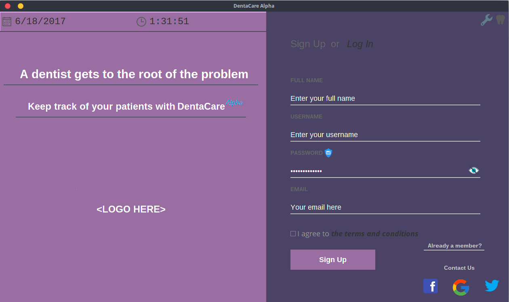

 
 <h1> DentaCare <h1>
 

<h1> Introduction
</h1> 
DentaCare is a simple and reliable Software Application built (and is still being built) for dental management and operation.    
Key features of DentaCare:  
<ul style="list-style-type:circle">
<li> Keep track of patients' record </li>
<ul> <li> No longer will dentists or dental secretaries have to deal with piles of papers of their patients' record just to keep track of their previous appointments, personal information and dental proceduries. DentaCare is a 21st century-looking, user-friendly software that does the data storage and ensures a secured and easily accessible data since DentaCare's database is non-cloud based. </li> 
<li> DentaCare even goes as far as being able to store an image or video of the patients' mouth and illustrate a before-and-after comparison, if necessary. </li> </ul> </ul>
<ul> <li> Set-up or View appointment with a real-time calendar and or Notify patients' appointment via email. </li> </ul>
<ul> <li> Cross-platform: Compatible on almost all Operating Systems </li> 
<ul> <li> Dentists are certain that they will get the compatibility, performance and realibility to the max since DentaCare was compiled and made through Java </li> </ul>
<ul> <li> The most friendly and customizeable UI you'll find. </li> 
<ul> <li> Choose your own font, background colors and a lot more customizeable options! </li> </ul> </ul> </ul> 
  

<a href= "https://www.facebook.com/groups/473984372933874/"> <u> See the software makers in Facebook </u> </a>  
dyneshoopuf - Justine Roy Olaguer  
rj-anne - Julliah Anne Reyes  

&nbsp; &nbsp; &nbsp; &nbsp; &nbsp; &nbsp; &nbsp; &nbsp; &emsp; &emsp; &emsp; &emsp; &emsp; &emsp; &emsp; &nbsp; &nbsp; &nbsp; &nbsp; &nbsp; &nbsp; &nbsp; &nbsp; &emsp; &emsp; &emsp; &emsp; &emsp; &emsp; &emsp; &nbsp; &nbsp; &nbsp; &nbsp; &nbsp; &nbsp; &nbsp; &nbsp; &nbsp; &nbsp; &nbsp; &nbsp; &nbsp; &nbsp; &nbsp; &nbsp; &nbsp; &nbsp; &nbsp; All rights reserved, Copyright protected
